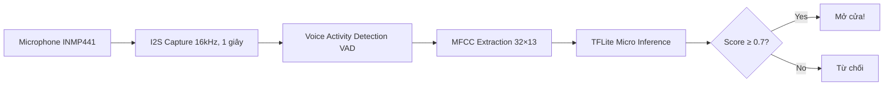
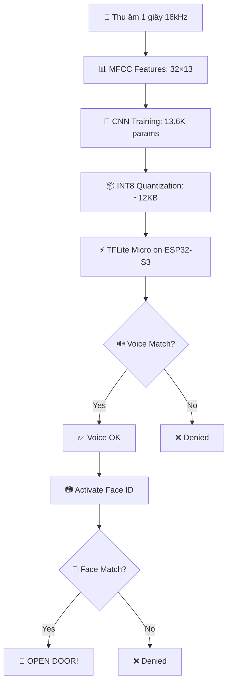

# 🎓 Bài Giảng: Xây Dựng Hệ Thống Nhận Diện Giọng Nói (Voice Authentication) trên ESP32-S3

## 📚 Tổng Quan Dự Án

**Dự án:** Hệ thống xác thực hai lớp (Voice + Face Recognition) chạy trên ESP32-S3
- **Input:** Microphone INMP441 (I2S), Camera OV2640
- **Output:** Servo mở cửa, LED RGB WS2812
- **Model Voice:** CNN nhẹ (~12KB) chạy TensorFlow Lite Micro
- **Model Face:** ESP-DL (pre-trained model từ Espressif)

**Bài giảng này tập trung vào Voice Authentication Pipeline.**

---

## 📋 Mục Lục

1. [Pipeline tổng quan](#1-pipeline-tổng-quan)
2. [Stage 1: Thu thập & Tiền xử lý dữ liệu](#2-stage-1-thu-thập--tiền-xử-lý-dữ-liệu)
3. [Stage 2: Feature Engineering - MFCC](#3-stage-2-feature-engineering---mfcc)
4. [Stage 3: Kiến trúc mô hình CNN](#4-stage-3-kiến-trúc-mô-hình-cnn)
5. [Stage 4: Huấn luyện mô hình](#5-stage-4-huấn-luyện-mô-hình)
6. [Stage 5: Đánh giá mô hình & Metrics](#6-stage-5-đánh-giá-mô-hình--metrics)
7. [Stage 6: Lượng tử hóa INT8 & Triển khai](#7-stage-6-lượng-tử-hóa-int8--triển-khai-embedded)
8. [Stage 7: Inference trên ESP32-S3](#8-stage-7-inference-trên-esp32-s3)
9. [Face Recognition Pipeline](#9-face-recognition-pipeline)
10. [Troubleshooting & Debugging](#10-troubleshooting--debugging)
11. [Bài tập thực hành](#11-bài-tập-thực-hành)

---

## 1. Pipeline Tổng Quan



**Data Flow (Luồng dữ liệu):**
```
Audio Raw (16-bit int, 16000 mẫu)
    → [I2S Read] → [Gain x4 + Clipping] → [Normalize]
    → [Hann Window] → [Real FFT (512-point)] → [Mel-scale binning]
    → [Log Energy] → MFCC Tensor (32×13)
    → [Conv2D → MaxPool → Conv2D → MaxPool → Flatten → Dense → Sigmoid]
    → Xác suất (0.0 - 1.0)
```

---

## 2. Stage 1: Thu thập & Tiền xử lý dữ liệu

### 2.1. Công cụ thu âm: `collect_data.py`

```python
# File: main/collect_data.py
import sounddevice as sd
import scipy.io.wavfile as wav
import numpy as np
import os

SAMPLE_RATE = 16000    # 16kHz - chuẩn cho voice recognition
DURATION = 1.0          # 1 giây mỗi mẫu
CLASS_NAME = "target"   # Hoặc "noise" cho tiếng ồn
NUM_SAMPLES = 20        # Số lượng mẫu cần thu
```

**Giải thích:**
- **Sample Rate 16kHz:** Đủ để capture giọng nói (dải tần ~300Hz-8kHz). Tiết kiệm bộ nhớ so với 44.1kHz.
- **1 giây/mẫu:** Tối ưu cho embedded - đủ để nhận diện giọng mà không quá tốn RAM.
- **Tín hiệu 16-bit:** Cân bằng giữa độ chính xác và kích thước dữ liệu.

### 2.2. Cấu trúc thư mục dataset

```
dataset/
├── target/        ← Giọng nói của bạn (người được ủy quyền)
│   ├── sample_0.wav
│   ├── sample_1.wav
│   └── ...
└── noise/         ← Tiếng ồn / giọng người khác
    ├── sample_0.wav
    ├── sample_1.wav
    └── ...
```

### 2.3. Tại sao cần 2 class (target vs noise)?

Đây là bài toán **Binary Classification**:
- **Class 0 (noise):** Mọi âm thanh KHÔNG phải giọng chủ nhà
- **Class 1 (target):** Giọng chủ nhà

> 📌 **Nguyên tắc:** Model không học "nhận diện giọng nói" theo nghĩa AI nghe hiểu. Nó học **phân biệt âm thanh** dựa trên phổ tần số. Vì thế, "noise" class càng đa dạng, model càng chống nhiễu tốt.

### 2.4. Tiền xử lý trên ESP32 (audio_capture.cpp)

```cpp
// Trích từ audio_capture.cpp
for (size_t i = 0; i < valid_samples; i++) {
    // INMP441: 24-bit left-justified in 32-bit slot
    // >> 14 -> gain x4, lấy 16-bit MSB
    int32_t sample = chunk_buf[i] >> 14;
    
    // Clipping: chống tràn số học
    if (sample > 32767) sample = 32767;
    else if (sample < -32768) sample = -32768;
    
    buffer[samples_read++] = (int16_t)sample;
}
```

**Vấn đề thực tế:**
- Microphone INMP441 trả về dữ liệu 24-bit trong gói 32-bit
- Dịch 14 bit thay vì 16 bit → khuếch đại tín hiệu lên ~4 lần
- => Giúp tín hiệu giọng nói nhỏ cũng được capture rõ

### 2.5. Data Augmentation (từ select_esc50.py)

File `select_esc50.py` cho phép import thêm từ dataset ESC-50 để tăng độ đa dạng của class "noise":

```python
SELECTED_CATEGORIES = {
    "coughing", "sneezing", "laughing",     // Âm thanh người
    "dog_bark", "cat",                       // Âm thanh động vật
    "car_horn", "siren",                     // Phương tiện
    "rain", "wind", "sea_waves",             // Thiên nhiên
    "washing_machine", "vacuum_cleaner",     // Thiết bị gia dụng
}
```

> 💡 **Kinh nghiệm:** Thu âm trong nhiều môi trường khác nhau (im lặng, có TV, có quạt, có người nói chuyện) giúp model chống nhiễu tốt hơn.

---

## 3. Stage 2: Feature Engineering - MFCC

### 3.1. Tại sao không dùng raw audio?

**Raw audio (1D waveform) có vấn đề:**
- Kích thước lớn: 16000 samples → 32KB mỗi mẫu
- Nhạy cảm với dịch chuyển thời gian (time shift)
- Không trích xuất được đặc trưng tần số một cách hiệu quả

**Giải pháp: MFCC (Mel-Frequency Cepstral Coefficients)**

### 3.2. Quy trình trích xuất MFCC (song song Python - C++)

Điểm đặc biệt của dự án này: **Feature extraction hoàn toàn được đồng bộ giữa Python training và C++ inference**.

```python
# Python (train_quantize_export.py)
def extract_mfcc(file_path):
    audio, sr = librosa.load(file_path, sr=SAMPLE_RATE)
    # 1. Pad/Trim về đúng 1 giây
    if len(audio) < SAMPLE_RATE:
        audio = np.pad(audio, (0, SAMPLE_RATE - len(audio)), 'constant')
    else:
        audio = audio[:SAMPLE_RATE]
    
    # 2. Normalize âm lượng (ĐỒNG BỘ với C++)
    max_val = np.max(np.abs(audio))
    if max_val > 0:
        audio = audio / max_val
    
    # 3. Windowing + FFT (ĐỒNG BỘ với C++)
    frames = 32
    hop = 512
    fft_size = 512
    features = np.zeros((frames, 13))
    
    window = 0.5 * (1.0 - np.cos(2 * np.pi * np.arange(fft_size) / fft_size))
    
    for i in range(frames):
        start_idx = i * hop
        segment = audio[start_idx : start_idx + fft_size]
        windowed = segment * window
        fft_result = np.fft.rfft(windowed)
        
        for b in range(13):  # 13 Mel bands
            bin_start = b * 19
            bin_end = (b + 1) * 19
            energy = np.sum(np.abs(fft_result[bin_start:bin_end])**2)
            features[i, b] = np.log(energy / (512.0 * 512.0) + 1e-6)
    
    return features  # Shape: (32, 13)
```

```cpp
// C++ (voice_auth.cpp) - ĐỒNG BỘ TUYỆT ĐỐI
static void compute_mfcc_like_features(...) {
    const int frames = 32;
    const int hop = 512;
    
    for (int i = 0; i < frames; i++) {
        // 1. Windowing (Hann)
        for (int j = 0; j < kFftSize; j++) {
            float sample_norm = audio[...] / max_val;  // CÙNG normalize
            fft_work_buf[j * 2] = sample_norm * hann_window[j];
            fft_work_buf[j * 2 + 1] = 0.0f;
        }
        
        // 2. FFT (ESP-DSP hardware-accelerated)
        dsps_fft2r_fc32(fft_work_buf, kFftSize);
        dsps_bit_rev_fc32(fft_work_buf, kFftSize);
        
        // 3. Mel binning (CÙNG 13 bands, CÙNG 19 bins/band)
        for (int b = 0; b < 13; b++) {
            float energy = sum of |fft[bin_start:bin_end]|^2;
            float val = logf(energy / (512.0f * 512.0f) + 1e-6f);
            // Quantize về INT8
            input_tensor->data.int8[i * 13 + b] = quantize(val);
        }
    }
}
```

> ⚠️ **Lưu ý kỹ thuật:** Code này dùng `bin_start = b * 19` thay vì mel-scale triangular filters chuẩn. Đây là MFCC "approximate" — đơn giản hóa để chạy nhanh trên embedded. Kết quả vẫn đủ tốt cho binary classification vì mục tiêu là phân biệt chứ không phải nhận dạng chi tiết.

### 3.3. Ý nghĩa của các tham số

| Tham số | Giá trị | Giải thích |
|---------|---------|------------|
| `frames` | 32 | Chia 1 giây âm thanh thành 32 khung (31.25ms mỗi khung) |
| `hop_length` | 512 | = 32ms tại 16kHz → overlap ~18.75ms (hơi chồng lấn nhẹ) |
| `fft_size` | 512 | Độ phân giải tần số: 16000/512 = 31.25Hz/bin |
| `n_mfcc` | 13 | 13 hệ số Mel (cân bằng giữa accuracy và kích thước model) |

### 3.4. Data Flow trực quan MFCC

```
Âm thanh 1 giây (16000 samples)
    │
    ▼
[Chia thành 32 frames, mỗi frame cách nhau 512 samples]
    │
    ├── Frame 0: samples [0:512]
    │   ├── × Hann Window (giảm rò rỉ phổ)
    │   ├── → 512-point FFT → 257 bins phức
    │   ├── → Power Spectrum |FFT|²
    │   ├── → Gộp vào 13 Mel-bands (approximate: mỗi band = 19 FFT bins)
    │   └── → log(energy + 1e-6) → 13 numbers
    │
    ├── Frame 1: samples [512:1024]
    │   └── ... (giống trên)
    │
    ├── ... (32 frames)
    │
    ▼
Kết quả: Tensor (32, 13, 1) ← 32 time × 13 frequency × 1 channel
```

---

## 4. Stage 3: Kiến trúc mô hình CNN

### 4.1. Tại sao chọn CNN?

Dữ liệu MFCC có cấu trúc **không gian 2 chiều**:
- **Trục Thời gian (32 frames):** Biến đổi theo thời gian
- **Trục Tần số (13 Mel-bands):** Phân bố năng lượng theo tần số

CNN có ưu điểm:
- Phát hiện **cục bộ**: accent, tone giọng
- **Bất biến vị trí**: dịch chuyện nhỏ về thời gian/tần số vẫn nhận diện được
- **Nhẹ, nhanh**: phù hợp embedded

### 4.2. Kiến trúc chi tiết

```
Input: (32, 13, 1) ← MFCC features
    │
    ▼
┌──────────────────────────────────────┐
│ Conv2D Layer 1                       │
│   Filters: 8, Kernel: 3×3, ReLU     │
│   Padding: 'same'                    │
│   → Output: (32, 13, 8)             │ ← Phát hiện patterns cục bộ
└──────────────┬───────────────────────┘
               │
               ▼
┌──────────────────────────────────────┐
│ MaxPooling2D                         │
│   Pool Size: 2×2                    │
│   → Output: (16, 6, 8)             │ ← Giảm chiều, giữ đặc trưng chính
└──────────────┬───────────────────────┘
               │
               ▼
┌──────────────────────────────────────┐
│ Conv2D Layer 2                       │
│   Filters: 16, Kernel: 3×3, ReLU    │
│   Padding: 'same'                    │
│   → Output: (16, 6, 16)            │ ← Học patterns phức tạp hơn
└──────────────┬───────────────────────┘
               │
               ▼
┌──────────────────────────────────────┐
│ MaxPooling2D                         │
│   Pool Size: 2×2                    │
│   → Output: (8, 3, 16)             │ ← Giảm chiều lần 2
└──────────────┬───────────────────────┘
               │
               ▼
┌──────────────────────────────────────┐
│ Flatten                              │
│   → Output: (384,)                  │ ← Dẹp thành vector 1D
└──────────────┬───────────────────────┘
               │
               ▼
┌──────────────────────────────────────┐
│ Dense (Fully Connected)              │
│   Units: 32, ReLU                   │
│   → Output: (32,)                   │ ← Feature vector
└──────────────┬───────────────────────┘
               │
               ▼
┌──────────────────────────────────────┐
│ Dense (Output)                       │
│   Units: 1, Sigmoid                 │ ← Xác suất [0,1]
│   → Output: scalar                  │
└──────────────┬───────────────────────┘
               │
               ▼
            Score: 0.87 → "Giọng chủ nhà! 🎉"
```

### 4.3. Các phép tính toán chi tiết

**Tổng số tham số:**
```
Conv2D 1: (3×3×1 + 1) × 8 = 80 params
Conv2D 2: (3×3×8 + 1) × 16 = 1168 params  
Dense 1: (384×32 + 32) = 12320 params
Dense 2: (32×1 + 1) = 33 params
----------------------------------------
Total: 80 + 1168 + 12320 + 33 = 13,601 params
```

> 💡 **Chỉ 13.6K tham số!** - So với model NLP có thể hàng trăm triệu tham số. Model này cực kỳ nhẹ. Sau INT8 quantization, toàn bộ file `.tflite` chỉ ~ **12KB** (~12,000 bytes) — bao gồm cả graph definition, weights, biases, và metadata.

### 4.4. Tại sao không dùng RNN/LSTM?

**Lý do kỹ thuật:**
- RNN yêu cầu trạng thái tuần tự → Cần nhiều RAM hơn
- TFLite Micro hỗ trợ RNN hạn chế
- CNN với 32 frames đã capture đủ temporal patterns
- CNN có thể tận dụng hardware acceleration (ESP-DL trên ESP32-S3)

---

## 5. Stage 4: Huấn luyện mô hình

### 5.1. Chuẩn bị môi trường

```bash
# Cài đặt thư viện
pip install tensorflow librosa numpy scipy sounddevice
```

> 💡 **Khuyến nghị:** Dùng Google Colab (GPU miễn phí). Upload dữ liệu lên Google Drive, mount vào Colab, chạy script train.

### 5.2. Code huấn luyện chính (`train_quantize_export.py`)

#### Bước 1: Load và xử lý dữ liệu

```python
X, y = [], []
for label, class_name in enumerate(["noise", "target"]):
    class_dir = os.path.join(DATASET_DIR, class_name)
    for file in os.listdir(class_dir):
        if file.endswith('.wav'):
            mfcc = extract_mfcc(os.path.join(class_dir, file))
            X.append(mfcc)
            y.append(label)

# Shape: (batch, 32, 13) → (batch, 32, 13, 1)
X = np.array(X)[..., np.newaxis]
y = np.array(y)
```

#### Bước 2: Định nghĩa model

```python
model = models.Sequential([
    layers.Input(shape=(32, 13, 1)),
    layers.Conv2D(8, 3, activation='relu', padding='same'),
    layers.MaxPooling2D(2),
    layers.Conv2D(16, 3, activation='relu', padding='same'),
    layers.MaxPooling2D(2),
    layers.Flatten(),
    layers.Dense(32, activation='relu'),
    layers.Dense(1, activation='sigmoid')
])
```

#### Bước 3: Compile và Train

```python
model.compile(
    optimizer='adam',
    loss='binary_crossentropy',  # Binary classification
    metrics=['accuracy']
)

history = model.fit(
    X, y,
    epochs=15,           # Số lần duyệt toàn bộ dataset
    batch_size=16,       # Số mẫu mỗi lần cập nhật weights
    validation_split=0.2 # 80% train, 20% validation
)
```

### 5.3. Giải thích Hyperparameters

#### Loss Function: `binary_crossentropy`

Công thức toán học:
```
Loss = -[y·log(ŷ) + (1-y)·log(1-ŷ)]

Trong đó:
- y  = ground truth (0 hoặc 1)
- ŷ = prediction (0.0 đến 1.0)
- Nếu y=1: Loss = -log(ŷ) → ŷ gần 1 thì loss nhỏ
- Nếu y=0: Loss = -log(1-ŷ) → ŷ gần 0 thì loss nhỏ
```

#### Optimizer: `Adam`

Adam = Adaptive Moment Estimation = SGD + Momentum + RMSprop

```
θ_t+1 = θ_t - η · m̂_t / (√v̂_t + ε)

Trong đó:
- m̂_t = moving average of gradients (momentum)
- v̂_t = moving average of squared gradients (adaptive LR)
- η = learning rate (mặc định 0.001)
```

> 💡 Adam gần như là "set-and-forget" optimizer, không cần tinh chỉnh nhiều.

#### Batch Size: 16

- **Quá lớn (ví dụ 64):** Cần nhiều RAM, dễ overfit, hội tụ chậm
- **Quá nhỏ (ví dụ 1):** Gradient nhiễu, hội tụ không ổn định
- **16:** Phù hợp với dataset nhỏ (thường 20-100 mẫu/class)

#### Epochs: 15

- Với binary classification đơn giản, 15 epochs là đủ
- Dấu hiệu cần dừng sớm: val_loss tăng lên (overfitting)

### 5.4. Cảnh báo về `validation_split` với dataset nhỏ

```python
validation_split=0.2  # ⚠️ Với 20 mẫu → chỉ 4 mẫu cho validation!
```

**Vấn đề:** Với dataset nhỏ (ví dụ 20 target + 30 noise = 50 total):
- Train: 40 mẫu
- Validation: 10 mẫu (chỉ ~5 mẫu/class)
- Validation metrics không đáng tin cậy!

**Giải pháp:**
1. **K-Fold Cross-Validation** (chia data thành K=5 folds, train trên 4 folds, val trên 1 fold, xoay vòng)
2. **Gom tất cả vào train**, test trên thực tế sau khi deploy
3. **Manual split** thay vì random: lấy 3 mẫu cuối mỗi class làm validation để đảm bảo phân bố

### 5.5. Thêm Early Stopping & Dropout để chống Overfitting

```python
from tensorflow.keras import layers, models
from tensorflow.keras.callbacks import EarlyStopping

# Model với Dropout
model = models.Sequential([
    layers.Input(shape=(32, 13, 1)),
    layers.Conv2D(8, 3, activation='relu', padding='same'),
    layers.MaxPooling2D(2),
    layers.Conv2D(16, 3, activation='relu', padding='same'),
    layers.MaxPooling2D(2),
    layers.Flatten(),
    layers.Dropout(0.3),            # ← Dropout 30% neurons ngẫu nhiên
    layers.Dense(32, activation='relu'),
    layers.Dropout(0.2),            # ← Dropout 20% cho output layer
    layers.Dense(1, activation='sigmoid')
])

# Early Stopping: dừng khi val_loss không cải thiện sau 5 epochs
early_stop = EarlyStopping(
    monitor='val_loss',
    patience=5,          # Chờ 5 epochs không cải thiện thì dừng
    restore_best_weights=True  # Giữ weights tốt nhất
)

history = model.fit(
    X, y,
    epochs=50,           # Tăng epochs tối đa
    batch_size=16,
    validation_split=0.2,
    callbacks=[early_stop]  # ← Dừng sớm khi overfit
)
```

> 📌 **Dropout hoạt động thế nào?** Mỗi lần forward, Dropout tắt ngẫu nhiên một tỷ lệ neurons (ví dụ 30%). Điều này buộc mạng không phụ thuộc vào bất kỳ neuron nào, tăng generalization.

### 5.6. Data Augmentation cho Audio

Khi có quá ít dữ liệu, có thể tự sinh thêm:

```python
def augment_audio(audio, sr=16000):
    """Data augmentation cho âm thanh"""
    augmented = []
    
    # 1. Thêm white noise nhẹ
    noise = np.random.normal(0, 0.005, len(audio))
    augmented.append(audio + noise)
    
    # 2. Dịch chuyển thời gian (±100ms)
    shift = int(np.random.uniform(-1600, 1600))
    augmented.append(np.roll(audio, shift))
    
    # 3. Thay đổi âm lượng (±20%)
    gain = np.random.uniform(0.8, 1.2)
    augmented.append(audio * gain)
    
    return augmented

# Cách tích hợp vào pipeline:
def load_dataset_with_augmentation(dataset_dir):
    X, y = [], []
    for label, class_name in enumerate(["noise", "target"]):
        class_dir = os.path.join(dataset_dir, class_name)
        for file in os.listdir(class_dir):
            if not file.endswith('.wav'): continue
            audio, sr = librosa.load(os.path.join(class_dir, file), sr=16000)
            mfcc = extract_mfcc_from_audio(audio)  # Mẫu gốc
            X.append(mfcc)
            y.append(label)
            
            aug_samples = augment_audio(audio)      # 3 mẫu augmented
            for aug in aug_samples:
                X.append(extract_mfcc_from_audio(aug))
                y.append(label)
    return np.array(X), np.array(y)

# → Dataset tăng từ 50 lên 200 mẫu!
```

---

## 6. Stage 5: Đánh giá mô hình & Metrics

### 6.1. Confusion Matrix

```
                    PREDICTED
                Negative    Positive
ACTUAL Negative     TN          FP      ← noise (class 0)
       Positive     FN          TP      ← target (class 1)
```

- **TP (True Positive):** Giọng chủ nhà → Được nhận diện ✅
- **TN (True Negative):** Tiếng ồn → Từ chối ✅
- **FP (False Positive):** Tiếng ồn → Bị nhầm là chủ nhà ❌ (nguy hiểm!)
- **FN (False Negative):** Giọng chủ nhà → Bị từ chối ❌ (bất tiện)

### 6.2. Các Metrics quan trọng

#### Công thức

```
Accuracy  = (TP + TN) / (TP + TN + FP + FN)
Precision = TP / (TP + FP)     ← Trong số những người được mở cửa, bao nhiêu % là đúng?
Recall    = TP / (TP + FN)     ← Trong số những lần chủ nhà nói, bao nhiêu % được mở cửa?
F1-Score  = 2 × (P × R) / (P + R)  ← Harmonic mean của Precision và Recall
```

#### Ví dụ thực tế

Giả sử test trên 40 mẫu (20 target + 20 noise):
```
TP=18, TN=17, FP=3, FN=2

Accuracy  = (18+17)/40 = 87.5%
Precision = 18/(18+3)  = 85.7%
Recall    = 18/(18+2)  = 90.0%
F1-Score  = 2×(0.857×0.9)/(0.857+0.9) = 87.8%
```

### 6.3. Precision vs Recall: Cái nào quan trọng hơn?

| Tình huống | Ưu tiên | Điều chỉnh |
|------------|---------|------------|
| **Bảo mật cao** (phòng server) | Precision cao | Tăng threshold → giảm FP, có thể tăng FN |
| **Tiện lợi cao** (cửa nhà) | Recall cao | Giảm threshold → giảm FN, có thể tăng FP |
| **Cân bằng** | F1-Score cao | Threshold mặc định 0.7 |

### 6.4. Cách đọc Loss/Accuracy curves

```
Training Progress Visualization:
                                            
Loss     │      .                             Accuracy  │   .   
(↓tốt)   │    .   .   .   .        (↑tốt)     │  .   .    
         │  .               .   .                │ .       .  .  .
         │ .         train_loss ───              │.   train_acc ───
         │           val_loss  - - -              │     val_acc  - - -
         └──────────────────────────             └────────────────────
              Epoch                                 Epoch
              5    10    15                             5    10    15
```

#### Các kịch bản thường gặp:

**1. Overfitting:**
```
train_loss: ↓ 0.65 → 0.12 → 0.01 (giảm liên tục)  ← NHỚ quá kỹ
val_loss:   ↓ 0.65 → 0.30 → 0.80 (tăng sau epoch 8)  ← KHÔNG generalize

→ Cần: Dropout, Early Stopping, thêm dữ liệu, hoặc giảm model complexity
```

**2. Underfitting:**
```
train_loss: ↓ 0.69 → 0.58 → 0.52 (giảm chậm, còn cao)
val_loss:   ↓ 0.70 → 0.60 → 0.55 (tương tự train_loss)

→ Cần: Tăng epochs, tăng model complexity, kiểm tra preprocessing
```

**3. Lý tưởng:**
```
train_loss: ↓ 0.69 → 0.25 → 0.15 (giảm ổn định)
val_loss:   ↓ 0.70 → 0.28 → 0.20 (giảm song song, sát train)

→ Model tốt. Dừng khi val_loss bắt đầu tăng.
```

### 6.5. `training_config.json` - Lưu lịch sử training

File này lưu trạng thái và kết quả training tốt nhất:

```json
{
  "sample_rate": 16000,
  "frame_size": 512,
  "hop_length": 512,
  "n_mels": 13,
  "n_mfcc": 13,
  "max_frames": 32,
  "train_samples": 80,
  "val_samples": 20,
  "best_val_auc": 0.92,
  "best_val_acc": 0.85
}
```

---

## 7. Stage 6: Lượng tử hóa INT8 & Triển khai Embedded

### 7.1. Tại sao cần INT8?

| Định dạng | Kích thước | Tốc độ | Thiết bị hỗ trợ |
|-----------|-----------|--------|-----------------|
| FP32 | ~52KB | Chậm | ESP32-S3 (có FPU nhưng chậm) |
| INT8 | ~12KB | Nhanh (4x) | ESP32-S3 (PIE + SIMD tối ưu) |

### 7.2. Post-Training Quantization

```python
# Representative dataset: 100 mẫu để calibrate scale/zero_point
def representative_data_gen():
    for input_value in tf.data.Dataset.from_tensor_slices(X).batch(1).take(100):
        yield [tf.cast(input_value, tf.float32)]

converter = tf.lite.TFLiteConverter.from_keras_model(model)
converter.optimizations = [tf.lite.Optimize.DEFAULT]
converter.representative_dataset = representative_data_gen
converter.target_spec.supported_ops = [tf.lite.OpsSet.TFLITE_BUILTINS_INT8]
converter.inference_input_type = tf.int8
converter.inference_output_type = tf.int8
tflite_model = converter.convert()

# File size: ~12KB (giảm 4x so với FP32)
```

**Quá trình lượng tử hóa:**
```
Float weight: 0.7234
    │
    ▼
Scale = (max_float - min_float) / 255
ZeroPoint = -128 - round(min_float / scale)
    │
    ▼
INT8: round(0.7234 / 0.0056) + (-30) = 99
    │
    ▼
Lưu trữ: 1 byte thay vì 4 bytes!
```

### 7.3. Xuất ra C Header/Code

**TFLite model (~12KB) → C array nhúng trực tiếp vào firmware:**

```c
// model_data.h
extern const unsigned char g_voice_auth_model_data[];
extern const int g_voice_auth_model_data_len;

// model_data.cc (được sinh tự động bởi export_to_c())
const unsigned char g_voice_auth_model_data[] = {
  0x20, 0x00, 0x00, 0x00, 0x54, 0x46, 0x4c, 0x33,  // TFLite header
  // ... ~12,000 bytes của model
};
const int g_voice_auth_model_data_len = 12000;
```

---

## 8. Stage 7: Inference trên ESP32-S3

### 8.1. Khởi tạo TFLite Micro

```cpp
bool voice_auth_init() {
    // 1. Load model từ Flash (embedded C array)
    model = tflite::GetModel(g_voice_auth_model_data);
    
    // 2. Khởi tạo operator resolver (đăng ký các op)
    static tflite::MicroMutableOpResolver<8> resolver;
    resolver.AddConv2D();
    resolver.AddMaxPool2D();
    resolver.AddReshape();
    resolver.AddFullyConnected();
    resolver.AddLogistic();   // Sigmoid
    resolver.AddShape();
    resolver.AddStridedSlice();
    resolver.AddPack();
    
    // 3. Cấp phát tensor arena (40KB trong PSRAM)
    tensor_arena = (uint8_t*)heap_caps_malloc(40 * 1024, MALLOC_CAP_SPIRAM);
    
    // 4. Khởi tạo interpreter
    static tflite::MicroInterpreter interpreter(model, resolver, tensor_arena, 40KB);
    interpreter->AllocateTensors();
}
```

### 8.2. Voice Activity Detection (VAD)

Trước khi chạy inference, có bước kiểm tra có tiếng nói không:

```cpp
// Trong voice_auth.cpp
float energy = 0;
int max_val = 0;
for (int i = 0; i < num_samples; i++) {
    energy += ((float)audio[i] * (float)audio[i]);
    int a = abs(audio[i]);
    if (a > max_val) max_val = a;
}
float rms = sqrtf(energy / num_samples);

if (rms < 30.0f || max_val < 100) {
    *score_out = -1.0f;  // Không có giọng nói
    return false;
}
```

> 📌 **VAD quan trọng vì:** Không nên chạy model khi không có giọng nói → tiết kiệm pin, tránh false positive.

### 8.3. Pipeline inference hoàn chỉnh

```cpp
bool voice_auth_verify(const int16_t* audio, int num_samples, float* score_out) {
    // 1. VAD
    if (no_speech_detected) { *score_out = -1.0f; return false; }

    // 2. Trích MFCC (đồng bộ với Python)
    compute_mfcc_like_features(audio, num_samples, input_tensor, max_val);

    // 3. Chạy TFLite inference
    interpreter->Invoke();

    // 4. Dequantize output (INT8 → Float)
    float prediction = (output->data.int8[0] - output->params.zero_point) 
                       * output->params.scale;

    *score_out = prediction;
    return (prediction >= AUTH_THRESHOLD);  // 0.7f
}
```

### 8.4. Dequantization chi tiết

```python
# Python side: output là float trong [0, 1] từ sigmoid

# C++ side: output là INT8 → cần giải lượng tử hóa
float prediction = (output->data.int8[0] - output->params.zero_point) 
                   * output->params.scale;
```

Ví dụ:
```
INT8 output = 67
zero_point = -3
scale = 0.0078

float = (67 - (-3)) × 0.0078 = 70 × 0.0078 = 0.546
```

---

## 9. Face Recognition Pipeline

### 9.1. Khác biệt với Voice

Face Recognition sử dụng **pre-trained model của Espressif** (không tự train):

```cpp
// Espressif ESP-DL models (đã train sẵn bởi Espressif)
face_detector = new human_face_detect::MSRMNP(
    "human_face_detect_msr_s8_v1.espdl",   // MNP: Multi-scale detection
    "human_face_detect_mnp_s8_v1.espdl"     // MSR: Refinement
);

face_recognizer = new HumanFaceRecognizer(
    HumanFaceFeat::MFN_S8_V1  // MobileFaceNet - pre-trained
);
```

### 9.2. Pipeline Face Recognition

```
Camera OV2640 (frame JPEG)
    │
    ▼
[Decode JPEG → RGB888]
    │
    ▼
[Face Detection: MSRMNP]
    │
    ├── Score ≥ detect_threshold (0.3)? → Tiếp tục
    │   └── < 0.3 → Bỏ qua
    │
    ▼
[Face Recognition: MobileFaceNet]
    │
    ├── Extract feature embedding (128D vector)
    │
    ▼
[So sánh với database]
    │
    ├── Similarity ≥ sim_threshold (0.5)? → Nhận diện thành công
    │   └── < 0.5 → "Unknown face"
```

### 9.3. Enrollment (Đăng ký khuôn mặt mới)

```cpp
// Ghi lại feature vector vào SPIFFS database
face_recognizer->enroll(img, detect_results);

// Lưu metadata (tên, ID) vào file /spiflash/face_meta.dat
strncpy(face_database[new_id].name, "Nguyen Van A", MAX_NAME_LENGTH);
save_face_metadata();
```

### 9.4. Dual-auth State Machine

```
┌─────────────┐
│  STANDBY    │ ← VoiceID listening, FaceID OFF, LED OFF
│  (Chờ đợi)  │
└──────┬──────┘
       │ Voice matched!
       ▼
┌─────────────────┐
│ VOICE_TRIGGERED │ ← FaceID activated, LED GREEN
│                 │
└──────┬──────────┘
       │ Face matched trong 10s?
       ▼
┌──────────┐   Yes   ┌────────────┐
│ FACE_AUTH│ ──────→ │ DOOR_OPEN  │ ← Servo mở, LED blink
└──────────┘         └──────┬─────┘
       │ No (timeout)        │ Timer (5s)
       ▼                     ▼
  ┌─────────┐         ┌────────────┐
  │ STANDBY │ ←────── │ Close door │
  └─────────┘         └────────────┘
```

---

## 10. Troubleshooting & Debugging

### 10.1. Overfitting

**Dấu hiệu:**
```
Epoch 1/15  - loss: 0.69, acc: 0.50, val_loss: 0.70, val_acc: 0.45
Epoch 5/15  - loss: 0.25, acc: 0.90, val_loss: 0.35, val_acc: 0.70
Epoch 10/15 - loss: 0.08, acc: 0.97, val_loss: 0.65, val_acc: 0.55  ← overfit!
Epoch 15/15 - loss: 0.01, acc: 1.00, val_loss: 1.20, val_acc: 0.50  ← overfit nặng
```

**Nguyên nhân & Giải pháp:**

| Nguyên nhân | Giải pháp |
|-------------|-----------|
| Quá ít dữ liệu | Collect thêm, dùng data augmentation (thêm noise, shift) |
| Model quá phức tạp | Giảm filters (4→8), thêm Dropout |
| Quá nhiều epochs | Dùng EarlyStopping với patience=5 |
| Không có noise class đa dạng | Import ESC-50 dataset |

### 10.2. Underfitting

**Dấu hiệu:**
```
Epoch 1/15  - loss: 0.70, acc: 0.50
Epoch 8/15  - loss: 0.60, acc: 0.60   ← loss giảm quá chậm
Epoch 15/15 - loss: 0.55, acc: 0.65   ← accuracy vẫn thấp
```

**Giải pháp:**
- Tăng epochs
- Tăng model complexity (thêm Conv2D filters: 16→32)
- Kiểm tra preprocessing có vấn đề không (MFCC C++ ≠ Python?)
- Giảm threshold (AUTH_THRESHOLD từ 0.7 xuống 0.5)

### 10.3. So sánh Training vs Inference

| Stage | Training (Python) | Inference (C++) |
|-------|-------------------|-----------------|
| Format | WAV file | I2S raw data |
| MFCC | `librosa` + numpy | ESP-DSP FFT + manual loop |
| Model | Keras (FP32) | TFLite Micro (INT8) |
| Quantization | None | INT8 with scale/zero_point |
| Output | Float sigmoid | Dequantized INT8 |

> ⚠️ **Vấn đề thường gặp nhất:** Nếu Python MFCC và C++ MFCC không khớp → inference accuracy kém trên hardware dù training accuracy cao.
> **Cách debug:** Lưu MFCC từ C++ ra UART, so sánh từng frame với Python MFCC.

### 10.4. Các vấn đề thường gặp khác

**Q: Model train accuracy 99% nhưng trên ESP32 chỉ đúng 50%?**
- **A:** Rất có thể MFCC extraction không đồng bộ. Kiểm tra normalization, window function, FFT implementation.

**Q: ESP32 crash khi chạy inference?**
- **A:** Tensor arena không đủ. Tăng `kTensorArenaSize` từ 40KB lên 48KB.

**Q: False positive nhiều (mở cửa sai)?**
- **A:** Tăng `AUTH_THRESHOLD` từ 0.7 lên 0.85. Hoặc thêm nhiều noise samples vào training.

**Q: False negative nhiều (không nhận diện được chủ nhà)?**
- **A:** Giảm `AUTH_THRESHOLD` xuống 0.5. Hoặc thu âm lại target trong nhiều điều kiện (sáng, tối, ồn, yên tĩnh).

### 10.5. Debug với tools

```bash
# 1. Phân tích model (số ops, input/output shape, quantization params)
python tools/analyze_tflite_model.py voice_auth.tflite

# 2. In danh sách operators để so sánh với OpResolver
python tools/dump_tflite_ops.py voice_auth.tflite

# Output mẫu:
#   [0] CONV_2D
#   [1] MAX_POOL_2D
#   [2] CONV_2D
#   [3] MAX_POOL_2D
#   [4] SHAPE
#   [5] STRIDED_SLICE
#   [6] PACK
#   [7] RESHAPE
#   [8] FULLY_CONNECTED
#   [9] FULLY_CONNECTED
#   [10] LOGISTIC
#  → Cần đăng ký đủ 8 ops trong MicroMutableOpResolver<8>
```

---

## 11. Bài tập thực hành

### 🎯 Bài 1: Thu thập dữ liệu
```bash
# Thu giọng của bạn (class = target)
python main/collect_data.py

# Đổi CLASS_NAME = "noise" trong collect_data.py, thu tiếng ồn
python main/collect_data.py

# Hoặc import từ ESC-50 dataset
python main/select_esc50.py path/to/esc50 ./esc50_selected --copy
```

### 🎯 Bài 2: Huấn luyện model cơ bản
```bash
python main/train_quantize_export.py
```
**Thử nghiệm:** Thay đổi `epochs` (10, 15, 30), so sánh loss và accuracy.

### 🎯 Bài 3: Thêm Dropout & Early Stopping

Sửa `train_quantize_export.py`:

```python
from tensorflow.keras.callbacks import EarlyStopping

# Thêm Dropout
model = models.Sequential([
    ...
    layers.Dropout(0.3),
    layers.Dense(32, activation='relu'),
    layers.Dropout(0.2),
    layers.Dense(1, activation='sigmoid')
])

# Thêm Early Stopping
early_stop = EarlyStopping(monitor='val_loss', patience=5, restore_best_weights=True)
model.fit(X, y, epochs=50, batch_size=16, validation_split=0.2, callbacks=[early_stop])
```

So sánh kết quả trước và sau khi thêm Dropout.

### 🎯 Bài 4: Tinh chỉnh Threshold

```python
# Trong Python
for thresh in [0.3, 0.5, 0.7, 0.9]:
    predicted = (model.predict(X_val) > thresh).astype(int)
    
    tp = sum((predicted == 1) & (y_val == 1))
    fp = sum((predicted == 1) & (y_val == 0))
    fn = sum((predicted == 0) & (y_val == 1))
    
    precision = tp / (tp + fp) if (tp + fp) > 0 else 0
    recall = tp / (tp + fn) if (tp + fn) > 0 else 0
    f1 = 2 * precision * recall / (precision + recall) if (precision + recall) > 0 else 0
    
    print(f"Threshold={thresh:.1f} | Precision={precision:.3f} | Recall={recall:.3f} | F1={f1:.3f}")
```

### 🎯 Bài 5: Nâng cao - Face Recognition
```
1. Mở web interface → http://esp32-ip/recognition
2. Nhập tên người dùng → click "Enroll"
3. Đứng trước camera → chụp ảnh
4. Thử recognize → kiểm tra kết quả
5. Thử với điều kiện ánh sáng khác nhau
```

### 🎯 Bài 6: K-Fold Cross-Validation (nâng cao)

```python
from sklearn.model_selection import StratifiedKFold

skf = StratifiedKFold(n_splits=5, shuffle=True, random_state=42)
accuracies = []

for train_idx, val_idx in skf.split(X, y):
    X_train, X_val = X[train_idx], X[val_idx]
    y_train, y_val = y[train_idx], y[val_idx]
    
    model = create_model()  # Hàm tạo model
    model.fit(X_train, y_train, epochs=15, batch_size=16, verbose=0)
    
    _, acc = model.evaluate(X_val, y_val, verbose=0)
    accuracies.append(acc)

print(f"5-Fold CV Accuracy: {np.mean(accuracies):.3f} ± {np.std(accuracies):.3f}")
```

---

## 📖 Tổng kết



**🔑 Điểm mấu chốt để dự án thành công:**

1. **Đồng bộ feature extraction Python - C++** là yếu tố #1 quyết định thành bại
2. **Data diversity** quan trọng hơn model complexity: 50 mẫu đa dạng > 200 mẫu giống nhau
3. **INT8 quantization** giảm 4x kích thước và tăng tốc, nhưng cần kiểm tra accuracy drop
4. **VAD** trước khi inference giúp tiết kiệm pin và giảm false positives
5. **Dual-auth** (Voice + Face) tăng bảo mật: vượt qua cả 2 lớp khó hơn nhiều so với 1

---

*"Trong Machine Learning cho Embedded, dữ liệu sạch và feature engineering tốt quan trọng hơn model phức tạp. Bắt đầu từ đơn giản, đo lường, rồi mới tối ưu!"* 🎯
